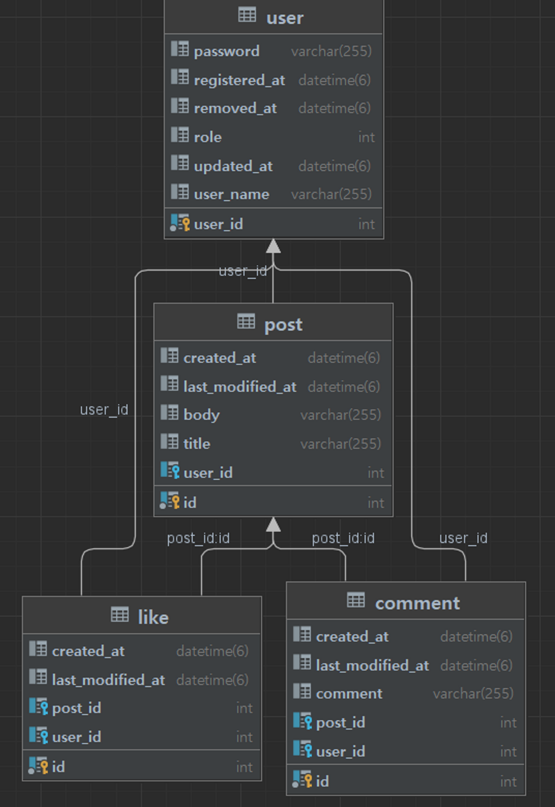

# 멋사스네스(MutsaSNS)

## 서비스 소개

### 1️⃣ 회원 인증·인가

- 모든 회원은 회원가입을 통해 회원이 됩니다.
- 로그인을 하지 않으면 SNS 기능 중 피드를 보는 기능만 가능합니다.
- 로그인한 회원은 글쓰기, 수정, 댓글, 좋아요, 알림 기능이 가능합니다.

### 2️⃣ 글쓰기

- 포스트를 쓰려면 회원가입 후 로그인(Token받기)을 해야 합니다.
- 포스트의 길이는 총 300자 이상을 넘을 수 없습니다.
- 포스트의 한 페이지는 20개씩 보이고 총 몇 개의 페이지인지 표시가 됩니다.
- 로그인 하지 않아도 글 목록을 조회 할 수 있습니다.
- 수정 기능은 글을 쓴 회원만이 권한을 가집니다.
- 포스트의 삭제 기능은 글을 쓴 회원만이 권한을 가집니다.

### 3️⃣ 피드

- 로그인 한 회원은 자신이 작성한 글 목록을 볼 수 있습니다.

### 4️⃣ 댓글

- 댓글은 회원만이 권한을 가집니다.
- 글의 길이는 총 100자 이상을 넘을 수 없습니다.
- 회원은 다수의 댓글을 달 수 있습니다.

### 5️⃣ 좋아요

- 좋아요는 회원만 권한을 가집니다.
- 좋아요 기능은 취소가 가능합니다.

### 6️⃣ 알림

- 알림은 회원이 자신이 쓴 글에 대해 다른회원의 댓글을 올리거나 좋아요시 받는 기능입니다.
- 알림 목록에서 자신이 쓴 글에 달린 댓글과 좋아요를 확인할 수 있습니다.

---

## 개발환경

- 에디터 : Intellij Ultimate
- 개발 툴 : SpringBoot 2.7.5
- 자바 : JAVA 11
- 빌드 : Gradle 6.8
- 서버 : AWS EC2
- 배포 : Docker
- 데이터베이스 : MySql 8.0
- 필수 라이브러리 : SpringBoot Web, MySQL, Spring Data JPA, Lombok, Spring Security

---

## 첫번째 미션

### 미션 요구사항 분석 & 체크리스트

---

**미션 요구사항 분석**

- REST API 명세를 문서화하기 위해 Swagger 사용
- AWS EC2 사용해서 Docker로 배포
- CI (Gitlab) / CD (Crontab) 구성
- 회원 인증·인가 - 회원가입 POST /api/v1/users/join
- 회원 인증·인가 - 로그인 POST /api/v1/users/login
- 포스트 - 포스트 리스트 GET /api/v1/posts
- 포스트 - 포스트 상세 GET /api/v1/posts/{postId}
- 포스트 - 포스트 등록 POST /api/v1/posts
- 포스트 - 포스트 수정 PUT /api/v1/{postId}
- 포스트 - 포스트 삭제 DELETE /api/v1/{postId}
- ErrorCode Enum으로 적용
- User (Controller/Service) Test Code
- Post (Controller/Service) Test Code

**체크리스트**

- [x] Swagger 적용
- [x] AWS EC2 인스턴스 생성
- [x] Docker로 배포
- [x] Gitlab CI .yml 파일 만들기
- [x] deploy shell script 만들어서 crontab 적용
- [x] 회원 인증·인가 기능
- [x] 포스트 기능
- [x] ErrorCode Enum으로 생성
- [x] ExceptionManager 만들기
- [ ] User Test Code
- [ ] Post Test Code

### 첫번째 미션 요약

---

**접근방법**

- Swagger 적용

    ```java
    implementation "io.springfox:springfox-boot-starter:3.0.0"
    implementation "io.springfox:springfox-swagger-ui:3.0.0"
    ```

    ```java
    @Configuration
    public class SwaggerConfig {
        @Bean
        public Docket api(){
            return new Docket(DocumentationType.OAS_30)
                    .select()
                    .apis(RequestHandlerSelectors.any())
                    .paths(PathSelectors.any())
                    .build();
        }
    }
    ```
  Swagger 적용해서 API 명세 관리와 직접 통신을 시도해서 요청을 보내고 결과값을 받아보며 Test 했다.


- AWS EC2 인스턴스 생성 및 Docker로 배포

  t2.micro 인스턴스를 생성해서 인스턴스에 Docker 설치해서 Spring Boot 프로젝트를 Docker로 배포했다.


- [CI (Gitlab) / CD (Crontab) 구성](https://itcouldbe-v.tistory.com/9)

  [Dockerfile](https://gitlab.com/yejinstar/finalproject_gimyejin_team12/-/blob/main/Dockerfile) 과 [.gitlab-ci.yml](https://gitlab.com/yejinstar/finalproject_gimyejin_team12/-/blob/main/.gitlab-ci.yml) 파일을 생성해서 Gitlab에서 main으로 push 할 때마다 build하게 하는 CI를 구성한다. crontab으로 인스턴스에서 새로운 container registry가 생성될 때마다 새롭게 container를 띄울 수 있도록 deploy shell scrpit를 실행시켜서 CI / CD 자동화를 적용한다.

  CI / CD 과정을 자동화하니까 기능 추가마다 배포과정을 직접 수행하지 않아도 되어서 기능 개발에 더 시간을 쓸 수 있었다.


- ERD

    

  JPA Auditing은 Spring Data JPA에서 시간에 대해서 자동으로 값을 넣어주는 기능이다.
  대표적으로 생성일자, 수정일자 등의 필드와 컬럼으로 사용할 수 있다. spring-boot-starter-data-jpa 의존성 추가해서 사용할 수 있다. 
  ```java
  @Getter
  @Setter
  @MappedSuperclass
  @EntityListeners(AuditingEntityListener.class)
  @ToString
  public class BaseEntity {

  @CreatedDate
  @Column(updatable = false)
  private LocalDateTime createdAt;

  @LastModifiedDate
  @Column
  private LocalDateTime lastModifiedAt;
  }
  ```
  BaseEntity 생성해서 UserEntity와 PostEntity가 상속받게 한다.

  ```java
  @Configuration
  @EnableJpaAuditing
  public class JpaAuditingConfiguration {
  }
  ```
  Contifiguration 클래스를 생성해서 JPA Auditing을 활성화 시키면 Auditing으로 생성, 변경시에 자동으로 DB에 업데이트 되도록 한다.

- 회원 인증·인가 기능 - 회원가입

  POST /api/v1/users/join 엔드포인트
    ```java
    @PostMapping("/join")
    public Response<UserJoinResponse> join(@RequestBody UserJoinRequest dto){
        UserJoinResponse userJoinResponse = userService.join(dto);
        return Response.success(userJoinResponse);
    }
    ```
  UserJoinRequest 와 UserJoinResponse DTO를 만든다.
  UserController join() 에서 UserJoinRequest로 회원가입 요청을 보내면 UserJoinResponse로 회원가입 요쳥 결과를 받는다.

    ```java
    public UserJoinResponse join(UserJoinRequest dto) {
            userRepository.findByUserName(dto.getUserName())
                    .ifPresent(user -> {
                        throw new AppException(ErrorCode.DUPLICATED_USER_NAME, String.format("userName:%s 는 이미 있습니다.", dto.getUserName()));
                    });
            UserEntity savedUser = userRepository.save(
                    UserEntity.builder()
                            .userName(dto.getUserName())
                            .password(encoder.encode(dto.getPassword()))
                            .role(UserRole.USER)
                            .build()
            );
            return UserJoinResponse.builder()
                    .userId(savedUser.getId())
                    .userName(savedUser.getUserName())
                    .build();
        }
    ```
  UserService에 join 메서드에서 UserRequest에 담긴 내용으로 UserEntity 만들어준다. EncrypterConfig.java BCryptPasswordEncoder를 사용하여 password를 encoding해서 UserRepository의 save() 기능으로 DB에 값을 넣어주고 UserJoinResponse 형태로 리턴하게 한다.

    ```java
    public class Response<T> {
        private String resultCode;
        private T result;

        public static <T> Response<T> error(T result) {

            return new Response("ERROR", result);
        }

        public static <T> Response<T> success(T result) {
            return new Response("SUCCESS", result);
        }
    }
    ```
  Controller에서 요청에 대한 Return 값의 형식을 JSON resultCode, result 로 일치시키기 위해 Response Class를 만들어 Response DTO가 상속 받을 수 있게 했다.

- 회원 인증·인가 기능 - 로그인

  POST /api/v1/users/login 엔드포인트
    ```java
    @PostMapping("/login")
    public Response<UserLoginResponse> login(@RequestBody UserLoginRequest dto) {
        UserLoginResponse userLoginResponse = userService.login(dto);
        return Response.success(userLoginResponse);
    }
    ```
  join 기능과 마찬가지로 UserLoginRequest, UserLoginResponse DTO 만들어서 로그인 기능을 구현했다.

  ```java
    public UserLoginResponse login(UserLoginRequest dto) {

        UserEntity user = userRepository.findByUserName(dto.getUserName())
                .orElseThrow(() -> {
                    throw new AppException(ErrorCode.USERNAME_NOT_FOUND, String.format("userName:%s 는 가입된 적이 없습니다.", dto.getUserName()));
                });

        if (!encoder.matches(dto.getPassword(), user.getPassword())) {
            throw new AppException(ErrorCode.INVALID_PASSWORD, "password가 잘못 되었습니다.");
        }

        return UserLoginResponse.builder()
                .jwt(JwtTokenUtil.createToken(user.getUserName(),secretKey,expireTimeMs))
                .build();
    }
    ```
    로그인에 성공하면 JWT 토큰을 return 받는다. JwtTokenUtil로 jwt 토큰을 만든다.

  ```java
    public class SecurityConfig {

        @Value("${jwt.token.secret}")
        private String secretKey;
        private final UserService userService;

        @Bean
        public SecurityFilterChain securityFilterChain(HttpSecurity httpSecurity) throws Exception {
            return httpSecurity
                    .httpBasic().disable()
                    .csrf().disable()
                    .cors().and()
                    .authorizeRequests()
                    .antMatchers("/api/v1/users/join", "/api/v1/users/login").permitAll() // join, login은 언제나 가능
                    .antMatchers(HttpMethod.GET, "/api/**").permitAll() // 모든 get요청 허용
                    .antMatchers(HttpMethod.POST, "/api/**").authenticated() // 모든 post요청을 인증된사용자인지 check
                    .and()
                    .sessionManagement()
                    .sessionCreationPolicy(SessionCreationPolicy.STATELESS) // jwt사용하는 경우 씀
                    .and()
                    .addFilterBefore(new JwtTokenFilter(userService, secretKey), UsernamePasswordAuthenticationFilter.class) //UserNamePasswordAuthenticationFilter적용하기 전에 JWTTokenFilter를 적용 하라는 뜻 입니다.
                    .build();
        }
    }
  ```

  Spring Security를 적용하면 권한 설정을 해줄 수 있다. SecurityConfig.java 에서 SecurityFilterChain HttpSecurity를 이용해 GET 요청에 대해서 허용을 해주어야 login, join을 수행할 수 있다. 


- 포스트 기능
  GET /api/v1/posts
  GET /api/v1/posts/{postId}
  POST /api/v1/posts
  PUT /api/v1/{postId}
  DELETE /api/v1/{postId}

    ```java
    @GetMapping("")
    public Response<PageInfoResponse> get(
            @PageableDefault(size = 20, sort = "createdAt", direction = Sort.Direction.DESC) Pageable pageable){
        PageInfoResponse posts = postService.get(pageable);
        return Response.success(posts);
    }

    /* Post 1개 조회 */
    @GetMapping("/{postId}")
    public Response<PostGetResponse> getOne(@PathVariable Integer postId){
        PostGetResponse postGetResponse = postService.getOne(postId);
        return Response.success(postGetResponse);
    }

    /* Post 작성 */
    @PostMapping("")
    public Response<PostPostingResponse> posting(@RequestBody PostPostingRequest dto, Authentication authentication){
        String userName = authentication.getName();
        PostPostingResponse postPostingResponse = postService.posting(dto, userName);
        return Response.success(postPostingResponse);
    }

    /* Post 수정 */
    @PutMapping("/{postId}")
    public Response<PostPostingResponse> edit(@PathVariable Integer postId, @RequestBody PostPostingRequest dto, Authentication authentication){
        String userName = authentication.getName();
        PostPostingResponse postPostingResponse = postService.edit(postId, dto, userName);
        return Response.success(postPostingResponse);
    }

    /* Post 삭제 */
    @DeleteMapping("/{postId}")
    public Response<PostPostingResponse> delete(@PathVariable Integer postId, Authentication authentication){
        String userName = authentication.getName();
        PostPostingResponse postPostingResponse = postService.delete(postId, userName);
        return Response.success(postPostingResponse);
    }
    ```
  PostController에 Post 조회, 리스트, 등록, 수정, 삭제 method 추가한다.
  포스트 조회할 때 필요한 PostGetResponse, 포스트 작성할 때 필요한 PostPostingRequest, PostPostingResponse 그리고 Page 관련 정보 관련 PageInfoResponse DTO를 만든다.

    ```java
    public PostPostingResponse posting(PostPostingRequest dto, String userName) {
        UserEntity user = userRepository.findByUserName(userName)
                .orElseThrow(() -> {
                    throw new AppException(ErrorCode.USERNAME_NOT_FOUND, String.format("userName:%s 이 없습니다.", userName));
                });

        PostEntity post = postRepository.save(
                PostEntity.builder()
                        .title(dto.getTitle())
                        .body(dto.getBody())
                        .user(user)
                        .build()
        );
        return PostPostingResponse.builder()
                .postId(post.getId())
                .message("포스트 등록 완료")
                .build();
    }

    public PostPostingResponse edit(Integer postId, PostPostingRequest dto, String userName) {
        PostEntity post = postRepository.findById(postId)
                .orElseThrow(() -> {
                    throw new AppException(ErrorCode.POST_NOT_FOUND, String.format("postId:%d 이 없습니다.", postId));
                });

        UserEntity user = userRepository.findByUserName(userName)
                .orElseThrow(() -> {
                    throw new AppException(ErrorCode.USERNAME_NOT_FOUND, String.format("userName:%s 이 없습니다.", userName));
                });

        if (!(post.getUser().getId() == user.getId())) {
            throw new AppException(ErrorCode.INVALID_PERMISSION,
                    String.format("postId:%d 의 작성자와 userName:%s 의 아이디 %d 가 일치하지 않습니다", postId, userName,user.getId() ));
        }

        post.setBody(dto.getBody());
        post.setTitle(dto.getTitle());

        postRepository.save(post);
        return PostPostingResponse.builder()
                .postId(post.getId())
                .message("포스트 수정 완료")
                .build();
    }

    public PostPostingResponse delete(Integer postId, String userName) {
        PostEntity post = postRepository.findById(postId)
                .orElseThrow(() -> {
                    throw new AppException(ErrorCode.POST_NOT_FOUND, String.format("postId:%d 이 없습니다.", postId));
                });

        UserEntity user = userRepository.findByUserName(userName)
                .orElseThrow(() -> {
                    throw new AppException(ErrorCode.USERNAME_NOT_FOUND, String.format("userName:%s 이 없습니다.", userName));
                });

        if (!(post.getUser().getId() == user.getId())) {
            throw new AppException(ErrorCode.INVALID_PERMISSION,
                    String.format("postId:%d 의 작성자 아이디 %d 와 userName:%s 의 아이디 %d 가 일치하지 않습니다", postId, post.getUser().getId(),userName,user.getId() ));
        }

        postRepository.delete(post);
        return PostPostingResponse.builder()
                .postId(post.getId())
                .message("포스트 삭제 완료")
                .build();
    }

    public PageInfoResponse get(Pageable pageable) {
        Page<PostEntity> posts = postRepository.findAll(pageable);
        Page<PostGetResponse> postGetResponses = posts.map(
                post -> PostGetResponse.builder()
                        .id(post.getId())
                        .body(post.getBody())
                        .title(post.getTitle())
                        .userName(post.getUser().getUserName())
                        .createdAt(post.getCreatedAt())
                        .lastModifiedAt(post.getLastModifiedAt())
                        .build());

        PageInfoResponse pageInfoResponse = PageInfoResponse.builder()
                .content(postGetResponses.getContent())
                .pageable("INSTANCE")
                .last(postGetResponses.hasNext()) // next 없으면 false
                .totalPages(postGetResponses.getTotalPages())
                .totalElements(postGetResponses.getTotalElements())
                .size(postGetResponses.getSize())
                .number(postGetResponses.getNumber())
                .sort(postGetResponses.getSort())
                .first(postGetResponses.isFirst())
                .numberOfElements(postGetResponses.getNumberOfElements())
                .empty(postGetResponses.isEmpty())
                .build();

        return pageInfoResponse;
    }

    public PostGetResponse getOne(Integer postId) {
        PostEntity post = postRepository.findById(postId)
                .orElseThrow(() -> {
                    throw new AppException(ErrorCode.POST_NOT_FOUND, String.format("postId:%d 이 없습니다.", postId));
                });

        return PostGetResponse.builder()
                .id(post.getId())
                .title(post.getTitle())
                .body(post.getBody())
                .userName(post.getUser().getUserName())
                .createdAt(post.getCreatedAt())
                .lastModifiedAt(post.getLastModifiedAt())
                .build();
    }
    ```
  post 관련 기능별 method 만들어서 비지니스 로직 구현한다.


**특이사항**

- TDD가 습관화 되어있지 않아서 Test 코드 작성에서 많은 혼란이 있었다. WebMvcTest를 더 깊게 공부해보고 Test Code 작성해볼것이다.
- 코드 리팩토링 할 때, Factory Method Pattern으로 코드 리팩토링해서 객체 생성하는 코드를 분리해서 유지보수에 편하게 만들어볼 것이다.
- 이번 미션하면서 읽어보고 공부했던 Security, Lombok, Page 내용 정리하기
- ERD와 UML 다이어그램 그려보기


